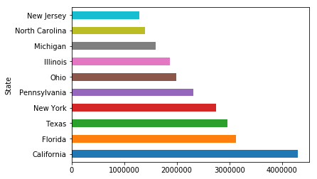
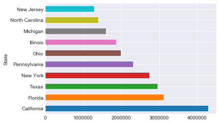
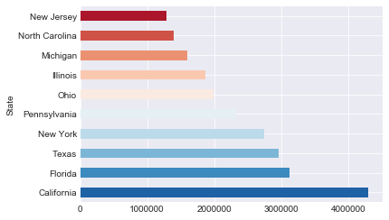

# Pandas Review


```python
import pandas as pd
```

## Previewing the file


```python
df = pd.read_csv('cdc_death_stats.csv')
df.head()
```


<div>
<style scoped>
    .dataframe tbody tr th:only-of-type {
        vertical-align: middle;
    }

    .dataframe tbody tr th {
        vertical-align: top;
    }

    .dataframe thead th {
        text-align: right;
    }
</style>
<table border="1" class="dataframe">
  <thead>
    <tr style="text-align: right;">
      <th></th>
      <th>Notes</th>
      <th>State</th>
      <th>State Code</th>
      <th>Ten-Year Age Groups</th>
      <th>Ten-Year Age Groups Code</th>
      <th>Gender</th>
      <th>Gender Code</th>
      <th>Race</th>
      <th>Race Code</th>
      <th>Deaths</th>
      <th>Population</th>
      <th>Crude Rate</th>
    </tr>
  </thead>
  <tbody>
    <tr>
      <th>0</th>
      <td>NaN</td>
      <td>Alabama</td>
      <td>1</td>
      <td>&lt; 1 year</td>
      <td>1</td>
      <td>Female</td>
      <td>F</td>
      <td>American Indian or Alaska Native</td>
      <td>1002-5</td>
      <td>14</td>
      <td>3579.0</td>
      <td>Unreliable</td>
    </tr>
    <tr>
      <th>1</th>
      <td>NaN</td>
      <td>Alabama</td>
      <td>1</td>
      <td>&lt; 1 year</td>
      <td>1</td>
      <td>Female</td>
      <td>F</td>
      <td>Asian or Pacific Islander</td>
      <td>A-PI</td>
      <td>24</td>
      <td>7443.0</td>
      <td>322.5</td>
    </tr>
    <tr>
      <th>2</th>
      <td>NaN</td>
      <td>Alabama</td>
      <td>1</td>
      <td>&lt; 1 year</td>
      <td>1</td>
      <td>Female</td>
      <td>F</td>
      <td>Black or African American</td>
      <td>2054-5</td>
      <td>2093</td>
      <td>169339.0</td>
      <td>1236.0</td>
    </tr>
    <tr>
      <th>3</th>
      <td>NaN</td>
      <td>Alabama</td>
      <td>1</td>
      <td>&lt; 1 year</td>
      <td>1</td>
      <td>Female</td>
      <td>F</td>
      <td>White</td>
      <td>2106-3</td>
      <td>2144</td>
      <td>347921.0</td>
      <td>616.2</td>
    </tr>
    <tr>
      <th>4</th>
      <td>NaN</td>
      <td>Alabama</td>
      <td>1</td>
      <td>&lt; 1 year</td>
      <td>1</td>
      <td>Male</td>
      <td>M</td>
      <td>Asian or Pacific Islander</td>
      <td>A-PI</td>
      <td>33</td>
      <td>7366.0</td>
      <td>448.0</td>
    </tr>
  </tbody>
</table>
</div>


```python
type(df)
```


    pandas.core.frame.DataFrame


## Series
#Just pandas way of calling columns


```python
#Preview a column (Pandas Series)
df.State.head() #the .head() method works for Series as well!
```


    0    Alabama
    1    Alabama
    2    Alabama
    3    Alabama
    4    Alabama
    Name: State, dtype: object


```python
#You can only use the above syntax if your column name has no spaces or special characters
#The syntax below always works.
df['State'].tail() #The general form for calling a column
```


    4110    Wyoming
    4111    Wyoming
    4112    Wyoming
    4113    Wyoming
    4114    Wyoming
    Name: State, dtype: object


## Subsetting the DataFrame

## Retrieve Column Names of DataFrame


```python
df.columns
```


    Index(['Notes', 'State', 'State Code', 'Ten-Year Age Groups',
           'Ten-Year Age Groups Code', 'Gender', 'Gender Code', 'Race',
           'Race Code', 'Deaths', 'Population', 'Crude Rate'],
          dtype='object')


## Subsetting the DataFrame by Columns


```python
df[df.columns[1:4]].head()
```


<div>
<style scoped>
    .dataframe tbody tr th:only-of-type {
        vertical-align: middle;
    }

    .dataframe tbody tr th {
        vertical-align: top;
    }

    .dataframe thead th {
        text-align: right;
    }
</style>
<table border="1" class="dataframe">
  <thead>
    <tr style="text-align: right;">
      <th></th>
      <th>State</th>
      <th>State Code</th>
      <th>Ten-Year Age Groups</th>
    </tr>
  </thead>
  <tbody>
    <tr>
      <th>0</th>
      <td>Alabama</td>
      <td>1</td>
      <td>&lt; 1 year</td>
    </tr>
    <tr>
      <th>1</th>
      <td>Alabama</td>
      <td>1</td>
      <td>&lt; 1 year</td>
    </tr>
    <tr>
      <th>2</th>
      <td>Alabama</td>
      <td>1</td>
      <td>&lt; 1 year</td>
    </tr>
    <tr>
      <th>3</th>
      <td>Alabama</td>
      <td>1</td>
      <td>&lt; 1 year</td>
    </tr>
    <tr>
      <th>4</th>
      <td>Alabama</td>
      <td>1</td>
      <td>&lt; 1 year</td>
    </tr>
  </tbody>
</table>
</div>


```python
cols = ['Notes', 'State', 'Population']
df[cols].head()
```


<div>
<style scoped>
    .dataframe tbody tr th:only-of-type {
        vertical-align: middle;
    }

    .dataframe tbody tr th {
        vertical-align: top;
    }

    .dataframe thead th {
        text-align: right;
    }
</style>
<table border="1" class="dataframe">
  <thead>
    <tr style="text-align: right;">
      <th></th>
      <th>Notes</th>
      <th>State</th>
      <th>Population</th>
    </tr>
  </thead>
  <tbody>
    <tr>
      <th>0</th>
      <td>NaN</td>
      <td>Alabama</td>
      <td>3579</td>
    </tr>
    <tr>
      <th>1</th>
      <td>NaN</td>
      <td>Alabama</td>
      <td>7443</td>
    </tr>
    <tr>
      <th>2</th>
      <td>NaN</td>
      <td>Alabama</td>
      <td>169339</td>
    </tr>
    <tr>
      <th>3</th>
      <td>NaN</td>
      <td>Alabama</td>
      <td>347921</td>
    </tr>
    <tr>
      <th>4</th>
      <td>NaN</td>
      <td>Alabama</td>
      <td>7366</td>
    </tr>
  </tbody>
</table>
</div>


```python
df[['Gender', 'Deaths']].head()
```


<div>
<style scoped>
    .dataframe tbody tr th:only-of-type {
        vertical-align: middle;
    }

    .dataframe tbody tr th {
        vertical-align: top;
    }

    .dataframe thead th {
        text-align: right;
    }
</style>
<table border="1" class="dataframe">
  <thead>
    <tr style="text-align: right;">
      <th></th>
      <th>Gender</th>
      <th>Deaths</th>
    </tr>
  </thead>
  <tbody>
    <tr>
      <th>0</th>
      <td>Female</td>
      <td>14</td>
    </tr>
    <tr>
      <th>1</th>
      <td>Female</td>
      <td>24</td>
    </tr>
    <tr>
      <th>2</th>
      <td>Female</td>
      <td>2093</td>
    </tr>
    <tr>
      <th>3</th>
      <td>Female</td>
      <td>2144</td>
    </tr>
    <tr>
      <th>4</th>
      <td>Male</td>
      <td>33</td>
    </tr>
  </tbody>
</table>
</div>


## Subsetting Rows using Conditionals


```python
#Only display data where the State Column is New York and the Deaths column is greater then 50.
ny_50plus = df[(df['State']=='New York')
  & (df['Deaths']>50)]
```


```python
print(len(df))
print(len(ny_50plus))
ny_50plus.head()
```

    4115
    82


<div>
<style scoped>
    .dataframe tbody tr th:only-of-type {
        vertical-align: middle;
    }

    .dataframe tbody tr th {
        vertical-align: top;
    }

    .dataframe thead th {
        text-align: right;
    }
</style>
<table border="1" class="dataframe">
  <thead>
    <tr style="text-align: right;">
      <th></th>
      <th>Notes</th>
      <th>State</th>
      <th>State Code</th>
      <th>Ten-Year Age Groups</th>
      <th>Ten-Year Age Groups Code</th>
      <th>Gender</th>
      <th>Gender Code</th>
      <th>Race</th>
      <th>Race Code</th>
      <th>Deaths</th>
      <th>Population</th>
      <th>Crude Rate</th>
    </tr>
  </thead>
  <tbody>
    <tr>
      <th>2606</th>
      <td>NaN</td>
      <td>New York</td>
      <td>36</td>
      <td>&lt; 1 year</td>
      <td>1</td>
      <td>Female</td>
      <td>F</td>
      <td>Asian or Pacific Islander</td>
      <td>A-PI</td>
      <td>485</td>
      <td>168826.0</td>
      <td>287.3</td>
    </tr>
    <tr>
      <th>2607</th>
      <td>NaN</td>
      <td>New York</td>
      <td>36</td>
      <td>&lt; 1 year</td>
      <td>1</td>
      <td>Female</td>
      <td>F</td>
      <td>Black or African American</td>
      <td>2054-5</td>
      <td>3767</td>
      <td>467735.0</td>
      <td>805.4</td>
    </tr>
    <tr>
      <th>2608</th>
      <td>NaN</td>
      <td>New York</td>
      <td>36</td>
      <td>&lt; 1 year</td>
      <td>1</td>
      <td>Female</td>
      <td>F</td>
      <td>White</td>
      <td>2106-3</td>
      <td>6505</td>
      <td>1456339.0</td>
      <td>446.7</td>
    </tr>
    <tr>
      <th>2610</th>
      <td>NaN</td>
      <td>New York</td>
      <td>36</td>
      <td>&lt; 1 year</td>
      <td>1</td>
      <td>Male</td>
      <td>M</td>
      <td>Asian or Pacific Islander</td>
      <td>A-PI</td>
      <td>626</td>
      <td>179832.0</td>
      <td>348.1</td>
    </tr>
    <tr>
      <th>2611</th>
      <td>NaN</td>
      <td>New York</td>
      <td>36</td>
      <td>&lt; 1 year</td>
      <td>1</td>
      <td>Male</td>
      <td>M</td>
      <td>Black or African American</td>
      <td>2054-5</td>
      <td>4654</td>
      <td>485909.0</td>
      <td>957.8</td>
    </tr>
  </tbody>
</table>
</div>


## Groupby


```python
#Grouping by a single feature
grouped = df.groupby('State')['Deaths'].sum()
grouped.head()
```


    State
    Alabama        860780
    Alaska          63334
    Arizona        838094
    Arkansas       522914
    California    4307061
    Name: Deaths, dtype: int64


```python
#Grouping by multiple features and reseting the index
grouped = df.groupby(['Gender', 'Race'])['Deaths'].sum().reset_index()
grouped.head()
```


<div>
<style scoped>
    .dataframe tbody tr th:only-of-type {
        vertical-align: middle;
    }

    .dataframe tbody tr th {
        vertical-align: top;
    }

    .dataframe thead th {
        text-align: right;
    }
</style>
<table border="1" class="dataframe">
  <thead>
    <tr style="text-align: right;">
      <th></th>
      <th>Gender</th>
      <th>Race</th>
      <th>Deaths</th>
    </tr>
  </thead>
  <tbody>
    <tr>
      <th>0</th>
      <td>Female</td>
      <td>American Indian or Alaska Native</td>
      <td>120827</td>
    </tr>
    <tr>
      <th>1</th>
      <td>Female</td>
      <td>Asian or Pacific Islander</td>
      <td>417760</td>
    </tr>
    <tr>
      <th>2</th>
      <td>Female</td>
      <td>Black or African American</td>
      <td>2601979</td>
    </tr>
    <tr>
      <th>3</th>
      <td>Female</td>
      <td>White</td>
      <td>19427767</td>
    </tr>
    <tr>
      <th>4</th>
      <td>Male</td>
      <td>American Indian or Alaska Native</td>
      <td>145492</td>
    </tr>
  </tbody>
</table>
</div>


# Matplotlib Review
Thus far we've primarily worked with the pyplot module within matplotlib.  
Also recall the ipython magic command for displaying graphs within notebooks:


```python
import matplotlib.pyplot as plt
%matplotlib inline
```

## A simple plot


```python
# df.Population = df.Population.astype(int)
to_plot = df.groupby('State').Deaths.sum().sort_values(ascending=False)
to_plot.head(2)
```


    State
    California    4307061
    Florida       3131111
    Name: Deaths, dtype: int64


```python
to_plot.head(10).plot(kind='barh')
```


    <matplotlib.axes._subplots.AxesSubplot at 0x10da3d198>





# Seaborn
Another very useful package that sits on top of matplotlib is called seaborn. Seaborn helps with figure asthetics and making your graphs by default better styled.


```python
import seaborn as sns
```

## Seaborn styles
One easy thing to do is change the figure asthetic of all future graphs. You can do this by setting a seaborn style with one line:


```python
sns.set_style('darkgrid')
```

Then simply rerunning our previous code:


```python
to_plot.head(10).plot(kind='barh')
```


    <matplotlib.axes._subplots.AxesSubplot at 0x1a1aeb1710>





Voila! Notice that nice background thanks to our seaborn style!

## Seaborn Color Palettes
Another nice feature are color palettes!
Here's a few examples:


```python
current_palette = sns.color_palette() #Save a color palette to a variable
sns.palplot(current_palette) #Preview color palette
```


```python
sns.palplot(sns.color_palette("Paired"))
```


```python
sns.palplot(sns.color_palette("Blues"))
```


And there are many many more! For a more complete description of available color palettes in seaborn check out the documentation here: https://seaborn.pydata.org/tutorial/color_palettes.html

## Applying a color palette to our previous example:


```python
color_palette = sns.color_palette("RdBu_r", 10) #The number reperesents how many colors you want
to_plot.head(10).plot(kind='barh', color = color_palette)
```


    <matplotlib.axes._subplots.AxesSubplot at 0x1a1b4e38d0>




